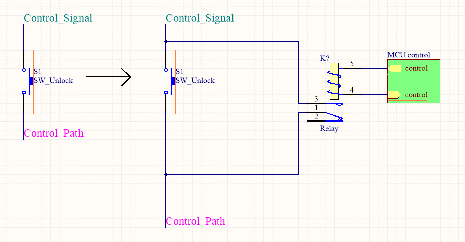

# EntranceAutomation

This is the original use case:
### for the guest
When the guest arrives, he/she should enter the door number of the host by the keyboard and then the bell in the host's house will ring. After the identity of the visitor is confirmed using the phone of the system, the host presses the bottom and then the locked door downstairs will be open. Then the visitor can walk in.
### for the host
When the host needs to go out or come back home, he/she has to use a RF key to open the door.
### for the administator
Remote manage all the RF keys, including enable the key or disable it.

## TARGET
And my target is remake the subsystem in my house in order to control it remotely for the first step and then to make all this automatic which I don't have to 

## Detailed Needs
Below is the original goals, but it seems that it's impossible to mock the knock action from the subsystem inside the house because even though we can generate the signal which should be from the downstairs, the state of the system downstairs do will stay the same and just won't react to the unlock action from my subsystem.

~~1. Control it inside the house~~

~~* Hack the original system~~

~~* Automated open~~

~~* Automated open only once when the control switch is turned on~~

~~2. Control it from local internet web page~~

~~3. Control it from internet web page~~

~~4. Control it on my phone~~

~~5. Control it automately depending on my position~~

so here is the compromising targets:(under the scenario that somebody or I have just enter my door number and the bell is ringring)
1. Unlock the door using a single button
2. Unlock the door through my computer wirelessly
3. Unlock the door automately whoever visits
4. Unlock the door automately only once since a button has been pressed
5. Unlock the door through a web page which is post to the internet
6. Unlock the door from APP
7. Unlock the door automately depending on my position

## Hace the subsystem
First take a look at of how the system works at the normal situation. 
1. When someone enters the door number, the phone rings. If phone is picked up and unlock key is pressed, the door downstairs will be unlocked, if nobody answers, after about twenty seconds, the phone stops ringing and even then the phone is picked up and press the unlock key, there won't be any effect. So there is a time window for us to take the decision of whether unlock the door or not.
2. If nobody enters the door number, press the unlock key inside the house, there won't be any actions taken place. So we couldn't simply unlock the door downstairs whenever we want.
3. Pick up the phone inside the house, there is nothing can be heard from the line. So some mechanic blocks the voice signal when nobody visits. 

Then disassembling the subsystem[TODO image]and it turns out to be that the main chip on the subsystem is HT12D which is a serial decoder. And it could be inferred from the PCB and the frame that the top-left switch(“SW_Hook” for short below) is for the pick up action and the one(“SW_Unlock” for short below) on the right-bottom is the unlock action which is exactly the same with the print.

So here is the simplest way to hack this subsystem. On one hand, add an additional path for each of the two switches, then the control logic could be taken over by any MCU that is responsible for it. On the other hand, monitor the signal from outside the subsystem or monitor the control logic signal inside the subsystem, then the MCU could takes over the control logic inside the right time window.

So the simplest way of control the subsystem is monitor D0 and once it becomes active, enable the SW_Hook first, and then enable the SW_Unlock, so the door downstairs shall be unlocked. And more option could be added after detecting the D0 is active, such as remote notation and remote control and so on.

# More Information 
Below is the debugging and some trying with the HT12D chip which does little help of implementing the goals that mentioned. But if you are interested of the chip's function just for your information.

From datasheet of HT12D and HT12E, when someone visits, device downstairs will launch the knocking by sending:
    [sync head(12x"000" and 1x"001" )] [A0-A7][D0-D3]
which in total 13 data signals. And "001" represents '1', "011" is '0'.

For HT12D, if 3 out of 4 times of code matched, VT output high(which is not used in this subsystem), D0-D3 will be latched(D0 is used as the control signal in this subsystem), till Din is no longer active.

address set on board is 0101 1011 as it could be seen from PCB:

wave measured is:
1(guiding code) 0101 1011 1100 as it could be seen from oscilloscope:

and my door number is 502 so it's matched correctly.

And here is a way of decoding the knocking signal on the MCU:
record the 1.5 times the width of the sync head and use it as the mark. when the width of the upcoming signal is less than the mark, a '1' is received otherwise is a '0'.
And of course if we have another HT12D then we could emit this procedure by just monitoring the D0 signal of this HT12D chip.

# Hardware Scheme
What we have now is the subsystem itself, and we plan to take control of the two main control switches of the subsystem and what's more we don't want to modify the original functions of the subsystem, which is to say that, we could use the subsystem as what it used to be after even we have modified the subsystem by our will.

For the sake of simplicity, We choose to use modules which are off the rack. All we have to do is to redirect the control pathes onto a SPDT and use a MCU to decide which input should appear on the control path.

From the figure below it's the sketch of the modification. On the left side is the original path of the two switches, on the right side is the modification scheme.(S2 is a MUX of 2, default state is connect 3 to 2 which makes the path is the same with the original scheme)
Here we use a N-channel power MOSFET as the switch which is on when grid is positive.

Wait a minute, we have another scheme that omits the SPDT and it seems better. Look at the picture below.

So this modification goes with the SW_Hook and the SW_Unlock (OR and the D0 signal path, see note below).

NOTE: for the monitor of someone visits, disconnect the D0 signal and connect it to MCU, and make the D0 signal path stay active all the time(which makes we can hear the talking all the time).(This is reserved for furthur experiment because it seems that when D0 signal path is always active, the system would be unable to function when someone enter any the door number, if this is confirmed, we can only monitor this signal and just leave it alone)

MCU we choose the STM8S103F module which is cost effective and easy to use.

Below is the total modules we use at this scheme.

# Software Scheme
All we have to do is to control the MOSFET and the MUX when the D0 is detected active.
So here is the scheme of unlock the door with a single button:
1. Monitor the D0 of HT12D, if D0 is active, enable the SW_Hook control signal and go to 2, otherwise return to 1.
2. If Test Key is pressed, enable the SW_Unlock control signal and go to 3, otherwise stay in 2.
3. Wait until D0 is no longer active and go to 1, otherwise stay in 3.

Then varies functions can be deprived from the scheme above, such as control it through my computer or my mobile phone, so before all that might happen, let's build it up bit by bit.

